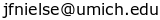

# Harmonized MRI: Vendor-agnostic MRI protocols

Welcome to the **Harmonized MRI** project, where we create open, vendor-independent
MRI pulse sequences for functional imaging and other applications.
Our vision is to create portable and fully transparent protocols for
more reproducible MRI across space (sites) and time.

The underlying acquisition technology is based on the [Pulseq](http://pulseq.github.io/) 
MR pulse sequence file format
that makes it possible to execute the same MR pulse sequence across multiple vendors
(at present, Siemens and GE are supported):

The code for this project is hosted on Github at
[https://github.com/HarmonizedMRI](https://github.com/HarmonizedMRI).

Funding is provided through an 
[NIH U24 grant](https://reporter.nih.gov/search/Y22HpwtGJ0GsUA9J9iqWoQ/project-details/10306940)
for dissemination of portable fMRI sequences, and an
[NIH R01 grant](https://reporter.nih.gov/search/Rc6iON3j_UieHv9Rbv10uQ/project-details/10704747)
to develop harmonized neuroimaging sequences for diffusion imaging and quantitative relaxation parameter mapping.

## Functional MRI protocol: Now recruiting early adopters

If you're interested in evaluating our fMRI protocols at your imaging center,
please send us an email at:  

See also the following Youtube talk:

<iframe width="600" height="338" src="https://www.youtube.com/embed/b5Il_A_et8o?si=z4qR-oA8bibG_uot" title="YouTube video player" frameborder="0" allow="accelerometer; autoplay; clipboard-write; encrypted-media; gyroscope; picture-in-picture; web-share" allowfullscreen></iframe>

<!--
We also welcome you to post your questions on our
[User Forum](https://github.com/HarmonizedMRI/UserForum/discussions).
-->
